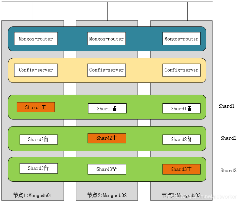

## MondgoDB分片集群搭建（Docker）
### 分片集群简介
&ensp;&ensp;在单机环境下，高频率的查询会给服务器 CPU 和 I/O 带来巨大的负担，基于这个原因，MongoDB 提供了分片机制用于解决大数据集的分布式部署，从而提高系统的吞吐量。一个标准的 MongoDB 分片集群通常包含以下三类组件：

- mongos，数据库集群请求的入口，所有的请求都通过mongos进行协调，不需要在应用程序添加一个路由选择器，mongos自己就是一个请求分发中心，它负责把对应的数据请求转发到对应的shard服务器上。在生产环境通常有多mongos作为请求的入口，防止其中一个挂掉所有的mongodb请求都没有办法操作。
- config server，为配置服务器，存储所有数据库元信息（路由、分片）的配置。mongos本身没有物理存储分片服务器和数据路由信息，只是缓存在内存里，配置服务器则实际存储这些数据。mongos第一次启动或者关掉重启就会从 config server 加载配置信息，以后如果配置服务器信息变化会通知到所有的 mongos 更新自己的状态，这样 mongos 就能继续准确路由。在生产环境通常有多个 config server 配置服务器，因为它存储了分片路由的元数据，防止数据丢失。
- shard，分片（sharding）是指将数据库拆分，将其分散在不同的机器上的过程。将数据分散到不同的机器上，不需要功能强大的服务器就可以存储更多的数据和处理更大的负载。基本思想就是将集合切成小块，这些块分散到若干片里，每个片只负责总数据的一部分，最后通过一个均衡器来对各个分片进行均衡（数据迁移）。
### 分片集群部署规划
#### 节点IP、组件及端口规划：
| 主机名     | IP地址        | mongos-router       | config-server       | shard                                  |
| :---------: | :------------: | :-------------------: | :-------------------: | :--------------------------------------: |
| mongodb01 | 192.168.1.11 | mongos-router:27017 | config-server:27018 | shard1:27019,shard2:27020,shard3:27021 |
| mongodb02 | 192.168.1.12 | mongos-router:27017 | config-server:27018 | shard1:27019,shard2:27020,shard3:27021 |
| mongodb03 | 192.168.1.13 | mongos-router:27017 | config-server:27018 | shard1:27019,shard2:27020,shard3:27021 |
#### 部署说明
- configServer配置服务器，建议部署为包含3个成员的副本集模式，出于测试目的，可以创建一个单成员副本集；
- shard分片，请使用至少包含三个成员的副本集。出于测试目的，可以创建一个单成员副本集；
- mongos没有副本集的概念，可以部署1个，2个或多个；
- 本次部署使用3台服务器，部署3个mongos、3个configServer、以及3个分片，每个分片包含3个成员，都分布在不同服务器上。
#### 部署架构图：

### Docker部署流程
#### 准备工作
##### 机器mongodb01(/data/mongo目录为例)
- 准备副本1配置(副本1)
  ```bash
  mkdir -p /data/mongo/srv-config/db /data/mongo/srv-config/log /data/mongo/srv-config/configdb

  touch /data/mongo/srv-config/log/mongodb.log

  chmod -R 777 /data/mongo/srv-config

  openssl rand -base64 128 > /data/mongo/srv-config/configdb/keyFile

  chmod 600 /data/mongo/srv-config/configdb/keyFile

  cat > /data/mongo/srv-config/configdb/mongod.conf <<EOF
  net:
    port: 27018
    bindIp: 0.0.0.0

  security:
    keyFile: /data/configdb/keyFile
    authorization: enabled

  systemLog:
    destination: file
    path: /data/log/mongodb.log
    logAppend: true

  replication:
    replSetName: rs-conf

  sharding:
    clusterRole: configsvr
    archiveMovedChunks: false

  storage:
    journal:
      enabled: true
    dbPath: /data/db/
    wiredTiger:
      engineConfig:
        cacheSizeGB: 0.5
  EOF
  ```
- 准备分片1配置(副本1)
  ```bash
  mkdir -p /data/mongo/shard1/db /data/mongo/shard1/log /data/mongo/shard1/configdb

  touch /data/mongo/shard1/log/mongodb.log

  chmod -R 777 /data/mongo/shard1

  # 将之前生成的keyFile拷贝到/data/mongo/shard1/configdb目录下

  cat > /data/mongo/shard1/configdb/mongod.conf <<EOF
  net:
    port: 27019
    bindIp: 0.0.0.0

  security:
    keyFile: /data/configdb/keyFile
    authorization: enabled

  systemLog:
    destination: file
    path: /data/log/mongodb.log
    logAppend: true

  replication:
    replSetName: rs-shard-1

  sharding:
    clusterRole: shardsvr
    archiveMovedChunks: false

  storage:
    journal:
      enabled: true
    dbPath: /data/db/
    wiredTiger:
      engineConfig:
        cacheSizeGB: 0.5
  EOF
  ```
- 准备分片2配置(副本1)
  ```bash
  mkdir -p /data/mongo/shard2/db /data/mongo/shard2/log /data/mongo/shard2/configdb

  touch /data/mongo/shard2/log/mongodb.log

  chmod -R 777 /data/mongo/shard2

  # 将之前生成的keyFile拷贝到/data/mongo/shard2/configdb目录下

  cat > /data/mongo/shard2/configdb/mongod.conf <<EOF
  net:
    port: 27020
    bindIp: 0.0.0.0

  security:
    keyFile: /data/configdb/keyFile
    authorization: enabled

  systemLog:
    destination: file
    path: /data/log/mongodb.log
    logAppend: true

  replication:
    replSetName: rs-shard-2

  sharding:
    clusterRole: shardsvr
    archiveMovedChunks: false

  storage:
    journal:
      enabled: true
    dbPath: /data/db/
    wiredTiger:
      engineConfig:
        cacheSizeGB: 0.5
  EOF
  ```
- 准备分片3配置(副本1)
  ```bash
  mkdir -p /data/mongo/shard3/db /data/shard3/log /data/mongo/shard3/configdb

  touch /data/mongo/shard3/log/mongodb.log

  chmod -R 777 /data/mongo/shard3

  # 将之前生成的keyFile拷贝到/data/mongo/shard3/configdb目录下

  cat > /data/mongo/shard3/configdb/mongod.conf <<EOF
  net:
    port: 27021
    bindIp: 0.0.0.0

  security:
    keyFile: /data/configdb/keyFile
    authorization: enabled

  systemLog:
    destination: file
    path: /data/log/mongodb.log
    logAppend: true

  replication:
    replSetName: rs-shard-3

  sharding:
    clusterRole: shardsvr
    archiveMovedChunks: false

  storage:
    journal:
      enabled: true
    dbPath: /data/db/
    wiredTiger:
      engineConfig:
        cacheSizeGB: 0.5
  EOF
  ```
- 准备mongos配置
  ```bash
  mkdir -p /data/mongo/mongos/configdb /data/mongo/mongos/log

  touch /data/mongo/mongos/log/mongodb.log

  chmod -R 777 /data/mongo/mongos

  # 将之前生成的keyFile拷贝到/data/mongo/mongos/configdb目录下

  cat > /data/mongo/mongos/configdb/mongos.conf <<EOF
  net:
    port: 27017
    bindIp: 0.0.0.0

  security:
    keyFile: /data/configdb/keyFile
    #authorization: enabled

  systemLog:
    destination: file
    path: /data/log/mongodb.log
    logAppend: true


  sharding:
    configDB: rs-conf/192.168.1.11:2018,192.168.1.12:2018,192.168.1.13:2018

  #storage:
    #journal:
      #enabled: true
    #dbPath: /data/db/
    #wiredTiger:
    # engineConfig:
      #  cacheSizeGB: 0.5
  EOF
  ```
##### 机器mongodb02(/data目录为例)
- 操作同上，也可以直接将上个机器的/data目录拷贝过来
- keyFile必须使用上个机器的同一个文件
- keyFile的权限必须为600
##### 机器mongodb03(/data目录为例)
- 操作同上，也可以直接将上个机器的/data目录拷贝过来
- keyFile必须使用上个机器的同一个文件
- keyFile的权限必须为600
#### 运行mongodb容器，并初始化
##### 副本集启动与初始化
- 三台机器都运行以下docker指令
  ```bash
  docker run -dit --restart=always -p 27018:27018 -v /data/mongo/srv-config/db:/data/db -v /data/mongo/srv-config/configdb:/data/configdb -v /data/mongo/srv-config/log:/data/log -v /etc/localtime:/etc/localtime:ro --name srv-config mongo:4.2.21 mongod -f /data/configdb/mongod.conf
  ```
- 选取任一机器进入srv-config容器
  ```bash
  docker exec -it srv-config bash

  mongo --port 27018

  use admin

  rs.initiate(
    {
      _id: "rs-conf",
      configsvr: true,
      members: [
        { _id : 0, host : "192.168.1.11:27018" },
        { _id : 1, host : "192.168.1.12:27018" },
        { _id : 2, host : "192.168.1.13:27018" }
      ]
    }
  )

  db.createUser({user:"admin",pwd:"your password",roles:[{role:"root",db:"admin"}]})
  ```
##### 分片1启动与初始化
- 三台机器都运行以下docker指令
  ```bash
  docker run -dit --restart=always -p 27019:27019 -v /data/mongo/shard1/db:/data/db -v /data/mongo/shard1/configdb:/data/configdb -v /data/mongo/shard1/log:/data/log -v /etc/localtime:/etc/localtime:ro --name shard1 mongo:4.2.21 mongod -f /data/configdb/mongod.conf
  ```
  - 选取任一机器进入shard1容器
  ```bash
  docker exec -it shard1 bash

  mongo --port 27019

  use admin

  rs.initiate(
    {
      _id: "rs-shard-1",
      members: [
        { _id : 0, host : "192.168.1.11:27019" },
        { _id : 1, host : "192.168.1.12:27019" },
        { _id : 2, host : "192.168.1.13:27019" }
      ]
    }
  )

  db.createUser({user:"admin",pwd:"your password",roles:[{role:"root",db:"admin"}]})
  ```
##### 分片2启动与初始化
- 三台机器都运行以下docker指令
  ```bash
  docker run -dit --restart=always -p 27020:27020 -v /data/mongo/shard2/db:/data/db -v /data/mongo/shard2/configdb:/data/configdb -v /data/mongo/shard2/log:/data/log -v /etc/localtime:/etc/localtime:ro --name shard2 mongo:4.2.21 mongod -f /data/configdb/mongod.conf
  ```
- 选取任一机器进入shard2容器
  ```bash
  docker exec -it shard2 bash

  mongo --port 27020

  use admin

  rs.initiate(
    {
      _id: "rs-shard-2",
      members: [
        { _id : 0, host : "192.168.1.11:27020" },
        { _id : 1, host : "192.168.1.12:27020" },
        { _id : 2, host : "192.168.1.13:27020" }
      ]
    }
  )

  db.createUser({user:"admin",pwd:"your password",roles:[{role:"root",db:"admin"}]})
  ```
##### 分片3启动与初始化
- 三台机器都运行以下docker指令
  ```bash
  docker run -dit --restart=always -p 27021:27021 -v /data/mongo/shard3/db:/data/db -v /data/mongo/shard3/configdb:/data/configdb -v /data/mongo/shard3/log:/data/log -v /etc/localtime:/etc/localtime:ro --name shard3 mongo:4.2.21 mongod -f /data/configdb/mongod.conf
  ```
- 选取任一机器进入shard3容器
  ```bash
  docker exec -it shard3 bash

  mongo --port 27021

  use admin

  rs.initiate(
    {
      _id: "rs-shard-3",
      members: [
        { _id : 0, host : "192.168.1.11:27021" },
        { _id : 1, host : "192.168.1.12:27021" },
        { _id : 2, host : "192.168.1.13:27021" }
      ]
    }
  )

  db.createUser({user:"admin",pwd:"your password",roles:[{role:"root",db:"admin"}]})
  ```
##### mongos启动与分片配置
- 三台机器都运行以下docker指令
  ```bash
  docker run -dit --restart=always -p 27017:27017 -v /data/mongo/mongos/configdb:/data/configdb -v /data/mongo/mongos/log:/data/log -v /etc/localtime:/etc/localtime:ro --name mongos mongo:4.2.21 mongos -f /data/configdb/mongos.conf
  ```
  - 选取任一机器进入mongos容器
  ```bash
  docker exec -it mongos bash

  mongo --port 27017

  use admin

  db.auth("admin","you password")

  sh.addShard( "rs-shard-1/192.168.1.11:27019,192.168.1.12:27019,192.168.1.13:27019")
  sh.addShard( "rs-shard-2/192.168.1.11:27020,192.168.1.12:27020,192.168.1.13:27020")
  sh.addShard( "rs-shard-3/192.168.1.11:27021,192.168.1.12:27021,192.168.1.13:27021")

  sh.status()
  ```
### 参考文献
- https://blog.csdn.net/one2threexm/article/details/117822683
- https://blog.csdn.net/networken/article/details/115409367

